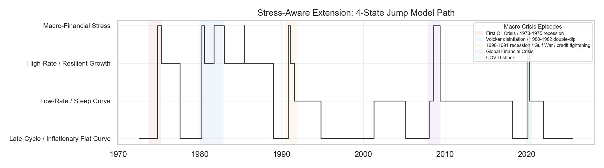
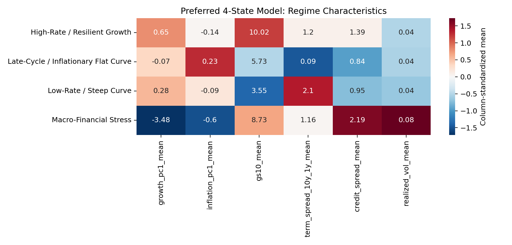
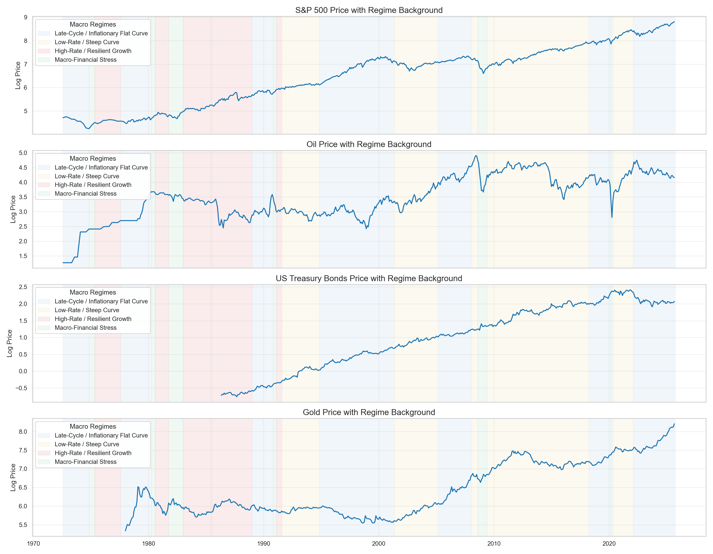

# Macro Regime Clustering: Stress-Aware Jump Models and Cross-Asset Mapping

Can a compact macro-financial feature space identify interpretable market regimes, and does a stress-aware extension improve historical crisis alignment? This repository answers that question with a monthly macro regime framework built from public U.S. macro and market data. The original **3-state baseline** remains useful because it is stable, parsimonious, and interpretable, but its state space is too coarse to isolate crisis-like episodes as a dedicated regime. The final preferred specification is therefore a **4-state Jump Model** that augments the compact baseline with **credit spread**, allowing the model to recover a distinct **Macro-Financial Stress** state while preserving medium-horizon persistence and interpretable state profiles.

## Final Model Snapshot

**Preferred model**

- **Model:** 4-state Jump Model
- **Penalty:** `p = 1.0`
- **Variables:** `growth_pc1`, `inflation_pc1`, `gs10`, `term_spread_10y_1y`, `credit_spread`
- **Why preferred:** it offers the best tradeoff between persistence and historical narrative alignment, and isolates a distinct stress regime that the compact baseline mixes into broader macro environments



The preferred model is not a recession classifier; it is a persistent macro-financial segmentation whose crisis-sensitive state aligns more closely with major stress episodes than the 3-state benchmark.

The benchmark baseline remains useful for reference, but the stress-aware final model is preferred because it separates crisis-like macro-financial stress from broader macro environments.

**Feature construction at a glance**

- `growth_pc1`: first principal component of the monthly **Growth** block, built from `cfnai`, `gdp_amom`, `ipgr_amom`, and `ism`
- `inflation_pc1`: first principal component of the monthly **Inflation** block, built from `cpi_amom`, `ppi_amom`, and `si_diff`
- `gs10`: 10-year Treasury yield level
- `term_spread_10y_1y`: `GS10 - GS1`
- `credit_spread`: `BAA - AAA`

## Why This Is the Preferred Model

The original 3-state compact baseline remains a useful benchmark because it is stable, parsimonious, and interpretable. But it is no longer the preferred model because its state space is too coarse to isolate crisis periods as a dedicated regime: major episodes such as 2008 and 2020 are absorbed into broader macro environments rather than separated into a stress state. The stress-aware extension adds `credit_spread` and allows a fourth state, which more naturally isolates a distinct stress-like regime and improves narrative alignment around the 1973-1975 oil-shock recession, the Volcker disinflation double-dip, the 1990-1991 credit-tightening recession, the Global Financial Crisis, and the COVID shock. The preferred penalty, `p = 1.0`, is not the most conservative setting; it is the setting that best balances persistence, crisis separation, and economic meaning.

## Four Regime Definitions

| State | Regime name | Interpretation |
|---|---|---|
| `state_0` | Late-Cycle / Inflationary Flat Curve | Moderate growth but flatter curve conditions, with somewhat firmer inflation pressure and tighter late-cycle macro conditions. |
| `state_1` | Low-Rate / Steep Curve | Lower-rate, steeper-curve environment consistent with easier financial conditions and recovery-like term structure. |
| `state_2` | High-Rate / Resilient Growth | Restrictive-rate environment with still-positive growth conditions rather than outright stress. |
| `state_3` | Macro-Financial Stress | Weak growth, the widest credit spreads, the highest realized volatility, weak equities, and the strongest bond performance. |

The labels are stored in [results/final_model/regime_labels.csv](results/final_model/regime_labels.csv).

## State Moments and Regime Characteristics

The preferred model is summarized in [results/final_model/regime_characteristics_summary.csv](results/final_model/regime_characteristics_summary.csv). The table below shows the core macro-financial state means plus selected asset return summaries.

| Regime | growth | inflation | gs10 | term spread | credit spread | realized vol | S&P ann. ret. | Bond ann. ret. |
|---|---:|---:|---:|---:|---:|---:|---:|---:|
| Late-Cycle / Inflationary Flat Curve | -0.07 | 0.23 | 5.73 | 0.09 | 0.84 | 0.0419 | 6.9% | 6.2% |
| Low-Rate / Steep Curve | 0.27 | -0.10 | 3.55 | 2.10 | 0.96 | 0.0403 | 9.1% | 7.9% |
| High-Rate / Resilient Growth | 0.52 | -0.16 | 9.97 | 1.21 | 1.39 | 0.0422 | 12.8% | 7.0% |
| Macro-Financial Stress | -3.59 | -0.54 | 8.89 | 1.10 | 2.31 | 0.0820 | 5.5% | 19.3% |

The key economic point is the fourth regime: **Macro-Financial Stress** is clearly differentiated by weak growth, the widest credit spreads, the highest volatility, weak equity outcomes, and the strongest bond behavior.



## Historical Narrative Alignment

The stress-aware extension is preferred because it maps more naturally to broad macro-financial stress episodes:

- First Oil Crisis / 1973-1975 recession
- Volcker disinflation / 1980-1982 double-dip recession
- 1990-1991 recession / Gulf War / credit tightening
- 2008-2009 Global Financial Crisis
- 2020 COVID shock

The main contribution is not just the addition of a fourth state, but the fact that the extra state has a clear economic interpretation as **Macro-Financial Stress** rather than as a noisy fragment. In practice, that means the preferred model better separates crisis-like macro-financial environments from ordinary late-cycle, low-rate, or high-rate expansion states. The model should still be read as capturing broad stress conditions, not as perfectly detecting every recession month or mechanically reproducing NBER turning points.

## Asset Mapping

The preferred regimes map cleanly into cross-asset behavior. The figure below keeps regime background shading and shows how equity, oil, bonds, and gold behave across the four-state classification.



Full asset results are stored in [results/final_model/asset_performance_by_regime.csv](results/final_model/asset_performance_by_regime.csv). A compact summary is below.

| Asset | Strongest regime | Annualized return | Weakest regime | Annualized return |
|---|---|---:|---|---:|
| S&P 500 | High-Rate / Resilient Growth | 12.8% | Macro-Financial Stress | 5.5% |
| Oil | Late-Cycle / Inflationary Flat Curve | 19.0% | Macro-Financial Stress | -48.8% |
| US Treasury bonds | Macro-Financial Stress | 19.3% | Late-Cycle / Inflationary Flat Curve | 6.2% |
| Gold | Late-Cycle / Inflationary Flat Curve | 11.1% | High-Rate / Resilient Growth | -2.8% |

This is descriptive asset mapping rather than a trading strategy, but it confirms that the final regimes correspond to distinct market environments rather than purely statistical partitions.

## Baseline Benchmark Comparison

The project still keeps the original **3-state compact Jump Model** as a **reference benchmark**. It uses:

- `growth_pc1`
- `inflation_pc1`
- `gs10`
- `term_spread_10y_1y`
- penalty `p = 0.6`

Why keep it:

- it is smaller and cleaner
- it is stable under nearby penalties and sample trims
- it remains a good benchmark for parsimony and interpretability

Why it is no longer preferred:

- it blends stress episodes into broader macro states
- it does not isolate a distinct macro-financial stress regime
- it is better as a comparison model than as the final interpretive specification

In short, the baseline is better for parsimony, while the preferred stress-aware model is better for crisis identification and macro-financial narrative alignment.

Reference benchmark outputs are curated under [results/baseline_reference](results/baseline_reference) and [figures/baseline_reference](figures/baseline_reference).


## Key Findings

- A compact macro core remains essential, but the preferred final model is **stress-aware**, not purely compact.
- Adding `credit_spread` and moving to **4 states** improves historical narrative alignment by isolating a distinct **Macro-Financial Stress** regime.
- The preferred model separates ordinary late-cycle, low-rate, and high-rate expansion environments more cleanly from broad crisis episodes.
- The stress regime is economically coherent: it combines weak growth, wide credit spreads, high volatility, weak equities, and strong bond performance.
- The old 3-state model is still valuable as a stable benchmark, but it is no longer the best final interpretive model.
- Cross-asset behavior differs meaningfully across regimes, supporting the economic relevance of the final classification.

## Repository Structure

```text
.
├── README.md
├── requirements.txt
├── data_raw/
├── data_processed/
├── figures/
│   ├── final_model/
│   └── baseline_reference/
├── results/
│   ├── final_model/
│   ├── baseline_reference/
│   ├── core/          # original baseline workflow outputs retained for reproducibility
│   ├── extensions/    # original extension workflow outputs retained for reproducibility
│   └── appendix/
├── docs/
├── src/
│   ├── data/
│   ├── models/
│   ├── reporting/
│   ├── archive/
│   └── run_final_model.py
└── LICENSE
```

## Reproducibility

Install dependencies:

```bash
pip install -r requirements.txt
```

### Reproduce the preferred final model outputs

```bash
python src/run_final_model.py
```

This runs the stress-aware 4-state interpretation script and assembles the curated GitHub-facing outputs under:

- [results/final_model](results/final_model)
- [figures/final_model](figures/final_model)

### Reproduce the baseline benchmark outputs

```bash
python src/models/jump_model/run_panel_g_pc2_no_bog_penalty_grid.py
python src/reporting/summarize_jump_model_penalty_profiles.py
python src/models/jump_model/run_jump_model_time_stability.py
python src/models/jump_model/run_jump_model_state_count_stability.py
python src/reporting/run_regime_interpretation.py
python src/reporting/build_final_outputs.py
```

The last command refreshes the curated `baseline_reference` and `final_model` folders from the underlying workflow outputs.

## Documentation

Supporting notes are in:

- [docs/model_selection.md](docs/model_selection.md)
- [docs/final_model_interpretation.md](docs/final_model_interpretation.md)
- [docs/baseline_vs_extension.md](docs/baseline_vs_extension.md)
- [docs/results_interpretation.md](docs/results_interpretation.md)

## Data Availability and Limitations

- Raw macro series and asset CSVs used in the project are included under [data_raw](data_raw).
- Processed panel files used for modeling are included under [data_processed](data_processed).
- The bond proxy (`VUSTX`) is stored locally as a monthly CSV for reproducibility.
- The preferred model captures broad macro-financial stress, but it does **not** perfectly identify every recession month.
- The results are monthly, descriptive, and conditional; they should not be read as a direct trading strategy or a recession prediction engine.
