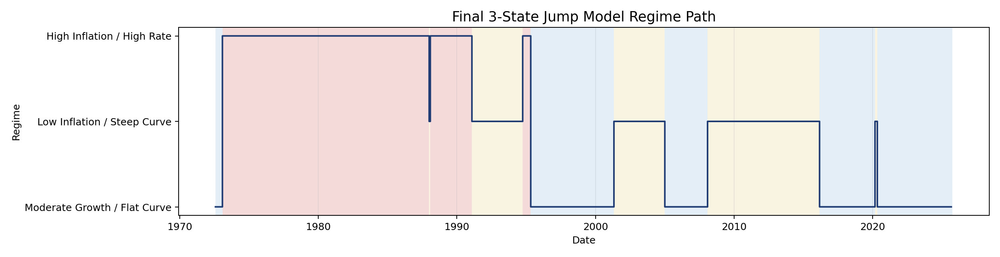
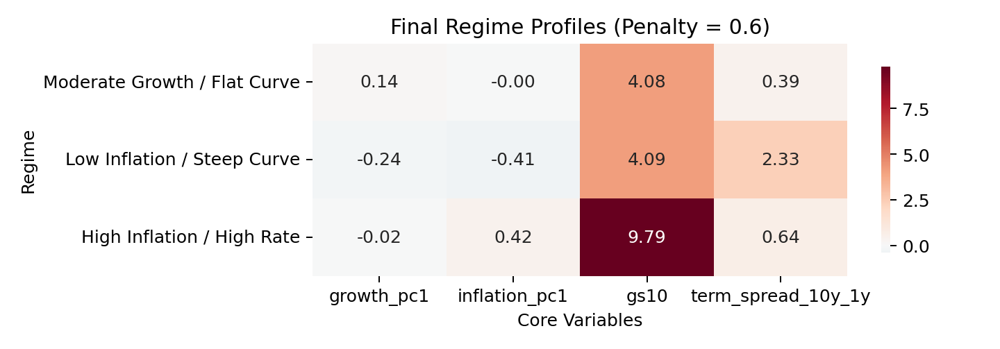
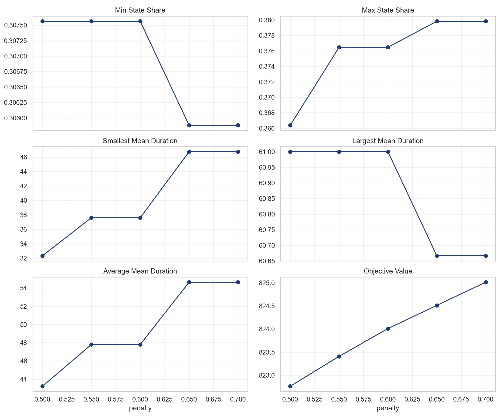
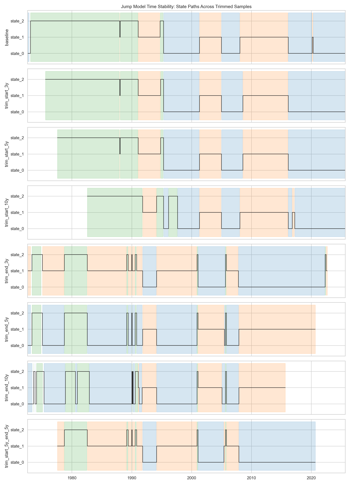
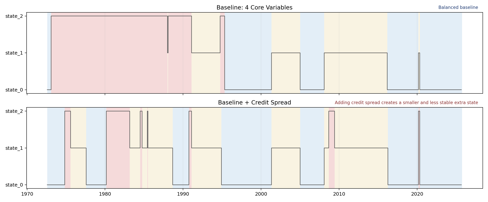
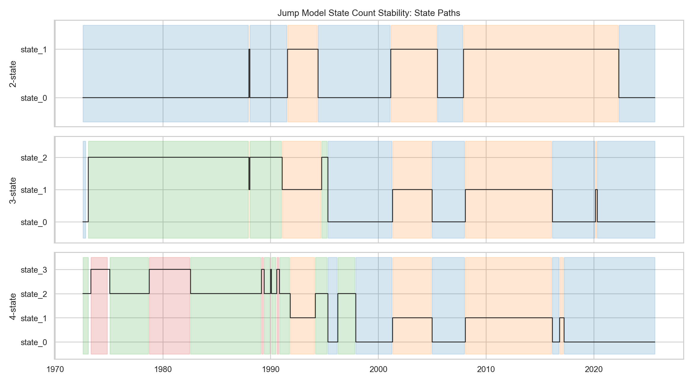
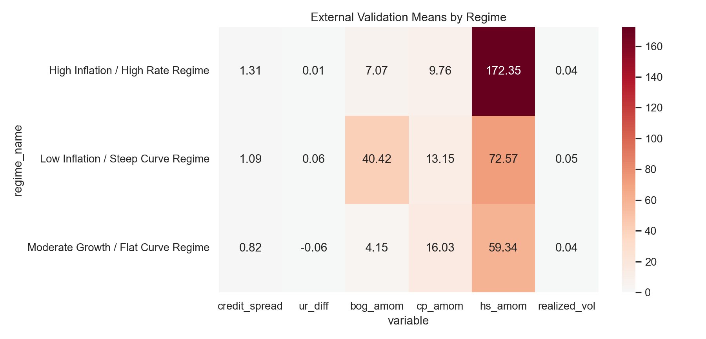
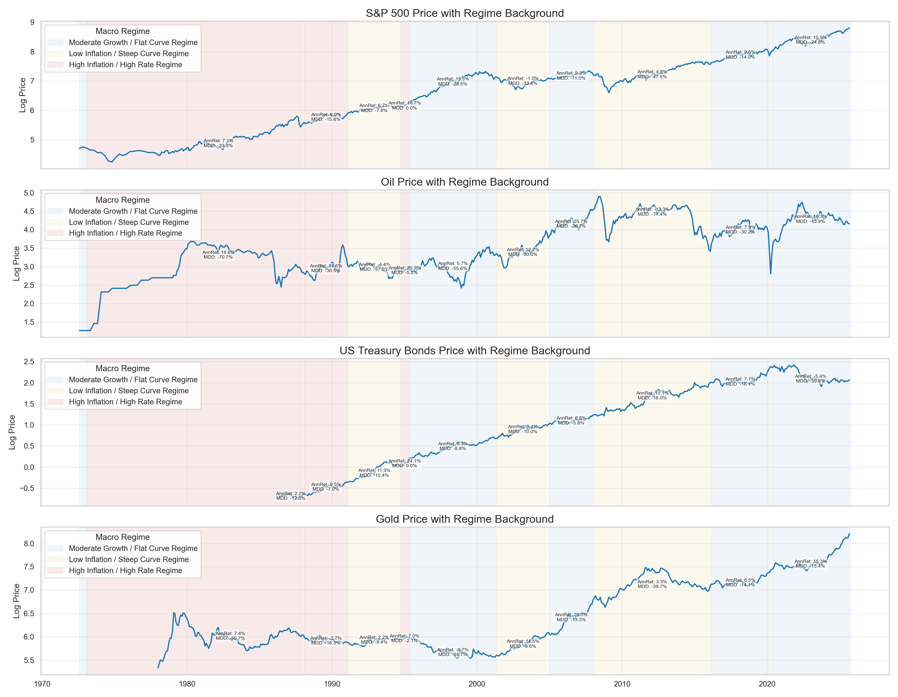

# Macro Regime Clustering with Jump Models and Asset Mapping

This repository studies whether a compact monthly macro state space can produce stable, interpretable market regimes and economically meaningful asset behavior.

## Final Results Snapshot

**Final model:** 3-state Jump Model, **penalty = 0.6**, built on four core variables:
`growth_pc1`, `inflation_pc1`, `gs10`, and `term_spread_10y_1y`.

The selected baseline is the smallest specification that remained balanced, persistent, interpretable, and externally valid.
The final segmentation is balanced and persistent, with regimes differentiated mainly by inflation, long-rate level, and curve shape.



This path should be read as a persistent macro classification rather than monthly noise, and the post-2020 sample is especially important for the third regime.

### Final State Profiles

| Regime | growth_pc1 | inflation_pc1 | gs10 | term_spread_10y_1y |
|---|---:|---:|---:|---:|
| Moderate Growth / Flat Curve | 0.136 | -0.004 | 4.08 | 0.39 |
| Low Inflation / Steep Curve | -0.243 | -0.411 | 4.09 | 2.33 |
| High Inflation / High Rate | -0.019 | 0.424 | 9.79 | 0.64 |



### Best-Performing Regime by Asset

| Asset | Best regime | Annualized return |
|---|---|---:|
| S&P 500 | Moderate Growth / Flat Curve | 13.3% |
| Oil | Moderate Growth / Flat Curve | 17.2% |
| Bond | Low Inflation / Steep Curve | 10.8% |
| Gold | Moderate Growth / Flat Curve | 7.5% |

This is only a summary view; the full cross-regime asset table appears later in the README and in the results folder.

## Project Overview

The project asks whether macro regimes can be identified from a small, interpretable monthly feature space rather than from a large everything-in panel. It starts from grouped macro panels, compares HMM and Jump Model baselines, and then narrows the variable space through structured sensitivity analysis. The final result is a 3-state Jump Model that remains reasonably stable under nearby penalties, sample trimming, and adjacent state counts. The regimes also line up with meaningful differences in credit conditions, labor dynamics, and asset performance.

## Final Regime Definitions

| State | Regime name | Main profile |
|---|---|---|
| `state_0` | Moderate Growth / Flat Curve Regime | moderate growth, near-neutral inflation, mid-rate backdrop, flatter curve |
| `state_1` | Low Inflation / Steep Curve Regime | weaker growth, lower inflation, moderate rates, steep curve |
| `state_2` | High Inflation / High Rate Regime | elevated inflation, high long rates, flatter curve backdrop |

These labels are stored in [`results/core/regime_interpretation/regime_labels.csv`](results/core/regime_interpretation/regime_labels.csv), while the numeric state means are already shown in the snapshot above.

## Data and Features

The broader project first builds grouped monthly panels for Growth, Inflation, Rate, and Other variables. Growth and Inflation are compressed with PCA; rates and auxiliary variables are kept on transformed economic scales.

The final model keeps only four variables:

- `growth_pc1`
- `inflation_pc1`
- `gs10`
- `term_spread_10y_1y`

This reduction was deliberate. Variables such as `bog_amom`, `ur_diff`, `credit_spread`, `cp_amom`, `hs_amom`, and `realized_vol` were useful for validation, but they either worsened balance, introduced fragmented states, or pushed the model toward market-stress rather than macro-state classification.

## Research Workflow

1. Build grouped macro panels from public monthly and quarterly series.
2. Compress the Growth and Inflation blocks with PCA.
3. Build a unified monthly macro panel.
4. Compare Gaussian HMM and Jump Model baselines.
5. Select the final state space, state count, and jump penalty.
6. Run penalty, time-trimming, and state-count stability checks.
7. Validate regimes with variables not used in the final model.
8. Map the final regimes to equity, oil, bond, and gold behavior.

## Why This Model?

### Why not the full panel

The broader macro panel was not healthier than the compact one. Adding more variables often produced one dominant state plus a small fragment, or states driven by auxiliary variables rather than by the macro core.

### Why not HMM

The Gaussian HMM benchmark was informative, but it was not selected as the main model. The main issue is not only balance; more importantly, HMM does not impose an explicit switching penalty in the way the Jump Model does. In this project, that made regime assignments more prone to frequent switching and weaker persistence, which is less suitable for identifying medium-horizon macro environments. The Jump Model produced a more stable and economically interpretable segmentation on the same reduced feature space.

### Why Jump Model

The Jump Model explicitly penalizes switching, which is useful in monthly macro classification. It avoids the over-switching problem of unconstrained clustering while still allowing meaningful regime changes.

### Why 3-state

With variables and penalty fixed, `2-state` is too coarse and merges distinct environments, while `4-state` starts splitting out a smaller extra state. `3-state` is the cleanest compromise between interpretability and parsimony.

### Why this penalty

The local grid over `0.50, 0.55, 0.60, 0.65, 0.70` stayed broadly stable, but `0.50` was more switchy and `0.65-0.70` were stickier. `0.60` sits in the stable middle of the grid and preserves balanced state shares and durations.

## Stability Analysis

### Penalty Stability

The local penalty grid supports a stable neighborhood around `0.55-0.60`.



### Time Stability

The time-stability exercise shows an asymmetric result: trimming the **start** of the sample does not materially rewrite the three-state structure, but trimming the **end** of the sample, especially the post-pandemic years, changes the balance much more. This suggests that recent macro regime shifts matter more for model performance than the earliest years in the sample.



### Variable Stability

The baseline is also more stable than nearby expanded specifications. Adding `credit_spread` to the final four-variable state space makes the classification visibly less balanced and introduces a smaller, less stable extra state, which is why credit is kept as a validation variable rather than a core state input.



### State-Count Stability

Holding the feature space and penalty fixed confirms that `3-state` remains the most balanced option between a too-coarse `2-state` solution and a more split `4-state` solution.



## External Validation

The final model is not fit on `credit_spread`, `ur_diff`, `bog_amom`, `cp_amom`, `hs_amom`, or `realized_vol`, but these variables still separate meaningfully across regimes.

Most informative validators:

- `credit_spread` is highest in the High Inflation / High Rate regime and lowest in Moderate Growth / Flat Curve.
- `ur_diff` is weakest in the Low Inflation / Steep Curve regime.
- `bog_amom` is highest on average in the Low Inflation / Steep Curve regime, though noisy.
- `realized_vol` differs across regimes, but less sharply than credit spreads.



These variables were excluded from the final state model, but they still sort meaningfully across regimes, which strengthens the economic interpretation of the final classification.

The underlying table is [`results/core/regime_interpretation/regime_external_validation_table.csv`](results/core/regime_interpretation/regime_external_validation_table.csv).

## Asset Behavior Across Regimes

The final regimes map meaningfully to monthly asset behavior:

- **Equities** do best in Moderate Growth / Flat Curve.
- **Bonds** do best in Low Inflation / Steep Curve.
- **Oil** is weakest in Low Inflation / Steep Curve.
- **Gold** performs well in both Moderate Growth / Flat Curve and Low Inflation / Steep Curve.

This matters because the regimes are not just statistical partitions; they correspond to distinct cross-asset market environments.



The full asset table is [`results/core/regime_interpretation/asset_performance_by_regime.csv`](results/core/regime_interpretation/asset_performance_by_regime.csv).

## Key Findings

- A compact 4-variable macro state space outperforms broader panels for regime detection in this project.
- A 3-state Jump Model provides the most balanced and interpretable segmentation.
- The final regimes are mainly differentiated by inflation, long-rate level, and curve shape.
- Nearby penalty values preserve the same broad regime structure, with `0.60` sitting in the most balanced part of the grid.
- The model is directionally stable, but sample-end trimming shows that the post-2020 period remains important to the final classification.
- Equity, bond, oil, and gold behave meaningfully differently across the final regimes.

## Limits

- The final states are better interpreted as **macro-financial environments** than as an NBER recession classifier.
- The classification is more sensitive at the sample end than at the sample start.
- Results depend on monthly feature construction and on the reduced four-variable state space.
- Asset mapping is descriptive regime conditioning, not a complete trading strategy.
- The bond proxy (`VUSTX`) is now stored locally as a monthly CSV, but it is still an external market series rather than a macro panel input.

## Repository Structure

```text
.
+-- README.md
+-- requirements.txt
+-- data_raw/
+-- data_processed/
+-- docs/
+-- figures/
+-- results/
|   +-- core/
|   \-- appendix/
\-- src/
    +-- data/
    +-- models/
    +-- reporting/
    \-- archive/
```

## Reproducibility

Install dependencies:

```bash
pip install -r requirements.txt
```

If you only want the main outputs, start with `figures/` and `results/core/`; if you want to rebuild the full pipeline, follow the run order below.

Suggested run order:

```bash
python src/data/build_all_panels.py
python src/data/build_final_macro_panel.py
python src/models/jump_model/run_panel_g_pc2_no_bog_penalty_grid.py
python src/reporting/summarize_jump_model_penalty_profiles.py
python src/models/jump_model/run_jump_model_time_stability.py
python src/models/jump_model/run_jump_model_state_count_stability.py
python src/reporting/run_regime_interpretation.py
```

Included in the repository:

- raw macro and asset CSVs used in the study
- a local monthly `VUSTX` bond series for asset mapping
- processed panel files
- final core result tables
- README-ready figures

See [`docs/results_interpretation.md`](docs/results_interpretation.md) for the fuller research narrative and interpretation.
